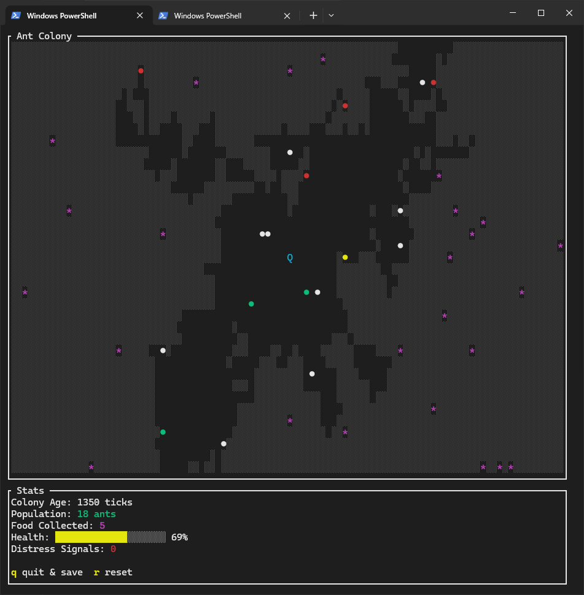

# Ant Farm

A terminal-based ant colony simulation built in Rust. Watch as ants explore, dig tunnels, collect food, and build pheromone trails in real-time.



## Features

- **Multi-state Ant Behavior**: Ants operate in four distinct states:
  - Wandering: Random exploration and state switching
  - Foraging: Food-seeking behavior with pheromone following
  - Carrying: Returning food to the queen with enhanced pheromone trails
  - Digging: Tunnel creation with directional persistence

- **Pheromone Communication System**: 
  - Home pheromones guide ants back to the colony
  - Distress pheromones signal low health conditions
  - Pheromones decay over time with different rates based on colony health

- **Colony Health Mechanics**:
  - Health decays over time (0.07 per tick)
  - Food collection restores 15 health points
  - Game over when health reaches zero
  - Low health triggers enhanced distress signaling

- **Dynamic World**:
  - Random food spawning throughout the simulation
  - Ant population growth up to 30 ants
  - Real-time tunnel excavation and expansion
  - Occupancy tracking prevents overcrowding

- **Save System**: Automatic save/load functionality to user home directory

## Requirements

- Rust 1.90.0 or later (tested with rustc 1.90.0)
- Terminal with Unicode and color support
- Minimum terminal size: 60x20 characters

## Installation

1. Clone the repository:
```bash
git clone https://github.com/Cod-e-Codes/ant-farm.git
cd ant-farm
```

2. Build the project:
```bash
cargo build --release
```

3. Run the simulation:
```bash
cargo run --release
```

## Usage

### Basic Usage
```bash
cargo run --release
```

### Command Line Options
- `--reset`: Start a fresh colony (ignores saved state)

### Controls
- `q`: Quit and save current state
- `r`: Reset to new colony (during gameplay)

### Save File Location
The simulation automatically saves to:
- Unix/Linux: `~/.ant-farm.json`
- Windows: `%USERPROFILE%\.ant-farm.json`

## Game Mechanics

### Ant States
- **White dots**: Wandering ants exploring randomly
- **Green dots**: Foraging ants seeking food
- **Yellow dots**: Carrying ants returning food to queen
- **Red dots**: Digging ants creating tunnels

### World Elements
- `░`: Solid ground (can be excavated)
- ` `: Empty tunnels
- `*`: Food sources
- `Q`: Queen ant (colony center)
- `!`: Distress pheromone signals

### Colony Management
- Ants spawn near the queen when population is below 30
- New ants start in digging state to encourage tunnel expansion
- Food collection increases colony health and population capacity
- Pheromone trails guide ant movement and coordination

## Technical Details

- **Tick Rate**: 150ms per simulation step
- **Maximum Population**: 30 ants
- **Pheromone Decay**: 0.92 per tick (home), variable for distress
- **Food Spawn Rate**: 1.5% chance per tick
- **Ant Spawn Rate**: 1.2% chance per tick

## Dependencies

- `crossterm`: Terminal manipulation
- `ratatui`: Terminal user interface
- `rand`: Random number generation
- `serde`: Serialization for save/load
- `serde_json`: JSON serialization format

## License

MIT License

Permission is hereby granted, free of charge, to any person obtaining a copy of this software and associated documentation files (the "Software"), to deal in the Software without restriction, including without limitation the rights to use, copy, modify, merge, publish, distribute, sublicense, and/or sell copies of the Software, and to permit persons to whom the Software is furnished to do so, subject to the following conditions:

The above copyright notice and this permission notice shall be included in all copies or substantial portions of the Software.

THE SOFTWARE IS PROVIDED "AS IS", WITHOUT WARRANTY OF ANY KIND, EXPRESS OR IMPLIED, INCLUDING BUT NOT LIMITED TO THE WARRANTIES OF MERCHANTABILITY, FITNESS FOR A PARTICULAR PURPOSE AND NONINFRINGEMENT. IN NO EVENT SHALL THE AUTHORS OR COPYRIGHT HOLDERS BE LIABLE FOR ANY CLAIM, DAMAGES OR OTHER LIABILITY, WHETHER IN AN ACTION OF CONTRACT, TORT OR OTHERWISE, ARISING FROM, OUT OF OR IN CONNECTION WITH THE SOFTWARE OR THE USE OR OTHER DEALINGS IN THE SOFTWARE.
